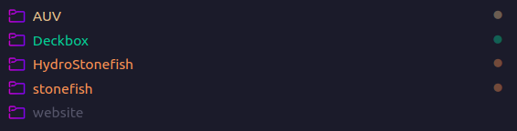
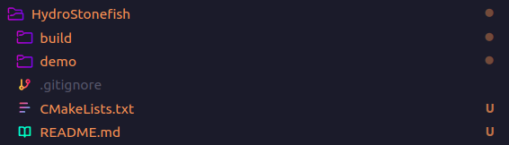

# URI Hydrobotics Stonefish Simulator
Repository to host the team's simulator application for testing AUVs


## Steps for Installation

- Follow initial installation steps for Stonefish itself [here](https://stonefish.readthedocs.io/en/latest/install.html).

- Here's what my directories look like if that makes it easier to understand. (Everything Hydro related I have in a master folder, then each repo has it's own directory)



- Upon reaching this portion of the guide is where you should probably stop following...

    - It's a bit out of date so I have added my own demo code in this repo to replace [this section](https://stonefish.readthedocs.io/en/latest/building.html)

        - Main differences include how the sphere object is created (some functions defined in the demo online no longer exist), and I've included a CMakeLists that actually compiles the simulator. Primarily because he swapped to the modern CMake syntax. 

To use: 

```bash
mkddir build # In the parent directory
cd build # Enter the build directory
cmake .. # Call CMakeLists.txt
make # Use make to build the demo executable
./demo # Run the demo executable, you should now see stonefish run 
```

- This is what your directory should look like



# !!DO NOT PUSH THE BUILD DIRECTORY!!
